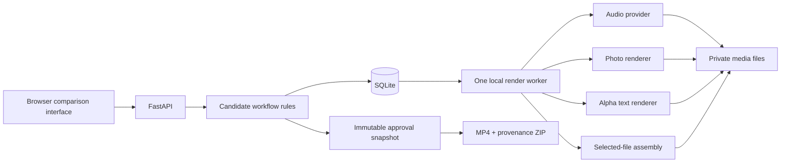

# Architecture and developer guide

## One application

A local FastAPI server serves a small JavaScript interface and delegates media work to one background thread. SQLite is the durable system of record. Files contain originals, normalized sources, immutable rendered candidates, and approved exports. No external generation service is called.

## Files and responsibilities

| File | Responsibility |
|---|---|
| `server.py` | HTTP, upload limits, local-origin checks, media range responses, startup |
| `models.py` | Narrow public request validation: one word, stars, fixed project options |
| `service.py` | Project/asset/candidate operations; selections, stale work, approvals, exports |
| `store.py`, `schema.sql` | Short SQLite transactions, IDs, JSON serialization, data-path boundary |
| `jobs.py` | Persisted batch queue, one worker, progress, restart recovery, explicit retry |
| `providers/__init__.py`, `providers/local.py` | Small audio request/result boundary and a local DSP implementation |
| `render.py` | Video, transparent Keyword, and final assembly; audio orchestration |
| `media.py` | FFmpeg/FFprobe, image normalization, hashing, sample/frame I/O, technical verification |
| `analysis.py` | Cheap audio and image features with explicit limitations |
| `styles.py`, `presets.json` | Editable families and seeded selection of three distinct styles |
| `demo.py` | Rights-clear generated practice assets and sample project |
| `web/` | Same-origin HTML/CSS/JavaScript, no frontend bundler |

## Data model

`users` stores a declared local author. Each `project` owns an author, aspect and duration. V1 exposes only 15 seconds; the internal field is retained for later migration.

`assets` holds role (reference/bed/effect/photo), original name, original and normalized file paths/hashes, analysis and contribution timestamp. Audio normalization uses the first 15 seconds and retains the full original. Photos use EXIF orientation, sRGB conversion when a profile is supplied, and a bounded working image.

`batches` records one explicit generation request, project, stage, seed, author and time. Each batch creates three `candidates`. Audio also creates a separate `kind=original` record in slot 4; UI never labels it Option 4.

Candidates store stage, status, the complete style/settings snapshot, source IDs, earlier selected candidate IDs (`context`), analysis, and hashed artifacts. Successful artifacts are never overwritten. `ratings` appends every 1–5 decision; current rating is the latest one. `winner_at` preserves the first five-star achievement even if the rating later changes. This policy is stated in the UI.

`selections` contains the current choice for each stage. Selection events retain previous decisions in `events`. Selecting a different upstream candidate clears all downstream selections. Old candidates remain visible and are marked stale when their saved context differs from current selections. Returning to the exact earlier context makes them compatible again.

`jobs` records each attempt, batch, state, progress, time, elapsed time, error and cost. Local per-call API cost is zero; this excludes computer/electricity costs. Future adapters must use null for unknown cloud charges.

`approvals` captures an immutable project snapshot: sources, every candidate considered, ratings, jobs, decisions, selected final output/hash, declared approving author, explanation, and timestamp. `exports` records each produced bundle and checksum. Later ratings or selections do not mutate approval history.

Schema is version 1. Future schema changes require explicit migrations and backup instructions; do not edit the initialization schema alone for an existing database.

## Selection and accountability

A completed candidate needs a rating before selection. It does not need five stars. Earlier stages must be selected before generating the next. The assembler uses the three explicit selections, never silently replaces them with higher-rated alternatives.

Final approval requires a completed, selected assembly matching current ingredient selections, all three final candidates ready, an explanation of at least five characters, and explicit confirmation. It verifies the final file's checksum. Export checks that the media still matches the approved hash and produces `approved.mp4`, `provenance.json`, and a short readme. Draft files remain downloadable and are labeled drafts; their existence does not imply approval.

The five-character threshold checks presence, not insight. The software cannot verify that a person listened carefully, wrote thoughtfully, or is the named author. Local author identity is declared at project creation. All decisions within that project use that declared author; authenticated collaborators are a future requirement.

## Jobs and failures

Enqueue in a transaction before doing work. Only one batch may be active per project. A single worker claims queued jobs transactionally and renders candidates sequentially outside database transactions. A filesystem lock prevents multiple server processes against the same data directory.

On restart, interrupted running jobs/candidates become failed; queued work can continue. A manual retry creates a new attempt and only processes missing/failed candidates. Completed outputs survive. Each attempt uses a new folder. If the server stops during a render, the next startup reports the interrupted work. Shutdown checks occur between frames/operations; an active FFmpeg subprocess can take up to its timeout to return.

No distributed queue, task broker, scheduler or auto-paid retries. Before a remote adapter ships, add provider request IDs, bounded timeouts, rate-limit handling, cancellation, spend authorization/limits, and reconciliation of uncertain outcomes. Do not equate HTTP timeout with no charge.

## Rendering and cross-stage awareness

Audio uses one personal reference plus optional uploaded bed/effect; otherwise quiet procedural sounds are synthesized. Nine editable preset recipes span delay, chopping, reverse, modulation, filtering and pitch/rhythm changes. Original Mix preserves source timing/pitch/order in the chosen excerpt and applies only common mix gain, a quiet bed and accents. It is not voice cloning or melody-to-song synthesis.

Video uses three families: liquid strip deformation, mirrored repetition, and aggressive crops/cuts. Audio energy onsets guide change times when usable; fallback is an explicitly labeled 1.5-second grid. An onset is not necessarily a beat. Sparse/ambiguous material can have unknown tempo.

Keyword is validated as a single word (up to 32 characters), stored as general text for future phrase support. Three styles use scaling, colored echoes, or movement. Text starts near a selected-video transition and uses a low-variation image band as a placement suggestion. This does not detect faces or important objects. Outlined letters help readability; human preview is still necessary.

Assembly composites the selected actual alpha file over the selected actual video and mixes the selected audio. Affinity uses the original layout; contrast uses a tighter crop and offset/shrunken title; buildup delays the title and fades sound in. Recipes record exact transforms and intent. This is a small editorial proposal system, not an artistic-quality optimizer.

## Media specifications

| Artifact | Specification |
|---|---|
| Audio | 15 s, 48 kHz stereo PCM WAV; constant gain targets -18 LUFS subject to a -1 dBTP measured ceiling |
| Video | 15 s, 450 frames / 30 fps, 1080×1920 or 1920×1080, silent H.264/yuv420p MP4, fast-start |
| Text master | 15 s, matching canvas/frame rate, ProRes 4444 MOV with alpha |
| Text preview | H.264 MP4 on neutral background for ordinary browser playback |
| Final | Matching 15 s H.264 MP4 with 48 kHz stereo AAC at 192 kb/s |
| Export | Approved MP4 plus versioned JSON provenance and explanation |

No end card, livestream URL, or multiword caption is added automatically. The mission is recorded, but story content remains the author's choice. Platform-specific captions and publishing are separate future work.

## Configuration and development

- `STUDIO_DATA_DIR`: private data root, default `data/candidate-engine` in a source checkout. `--data-dir` takes precedence.
- `STUDIO_PRESETS`: optional replacement JSON preset file. Otherwise bundled `presets.json`.
- `--port`: default 8773; host is always 127.0.0.1.
- No API keys or other environment variables are required. Do not commit `.env`, media or databases.

Change presets by editing name, description, family, color, mode and supported parameters. Every stage needs at least three different families and unique IDs. Mode names correspond to implemented renderer functions; a new arbitrary mode requires code and tests. Every batch saves the full recipe, so edits do not rewrite old candidates. Duration is not a user-facing preset control.

Use `pytest`, `ruff check`, and `ruff format` as described in TESTING.md. API routes and request shapes are generated at `/docs`. Rate/select endpoints target candidate IDs; projects scope uploads/generation/approvals; exports refer only to approval IDs.

## Collaboration and legacy data

Canonical repository: `dannygoldfield/MIT-2009-Social-Studio`. Branches and pull requests are the recommended collaboration path. The previous local checkout is not automatically updated by this build. Pull the repository there only when ready to switch versions; legacy media/data are not migrated.

No runtime imports, symlinks, database connections, or mutations point into HPR. `tools/check_hpr_unchanged.py` is an optional read-only local audit, and is not required on Talla's machine. Its references are historical fingerprints, not package dependencies.
